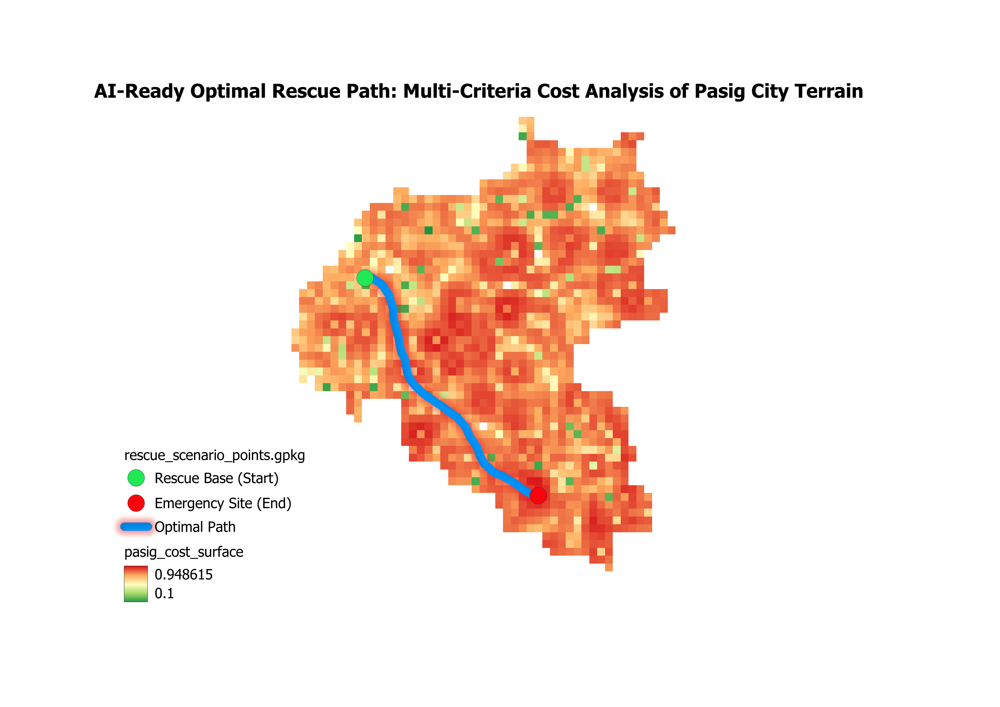

# 🎯 AI-Ready Optimal Rescue Path Planning (MCDM Analysis)

## Project Overview

This project demonstrates the development of an **AI-Ready Cost Surface** for terrain-constrained optimal path planning, specifically applied to an emergency rescue scenario in the Pasig City watershed (Metro Manila, Philippines).

The primary goal is to shift from simple distance-based routing to **Multi-Criteria Decision Making (MCDM)** routing, where the path is optimized for **speed AND safety** by avoiding high-cost terrain features like steep slopes and low-lying, flood-prone areas.

| Technical Achievement | Deliverable | 
| :--- | :--- |
| **Core Method** | Multi-Criteria Decision Making (MCDM) / Weighted Overlay | 
| **Primary Output** | `pasig_cost_surface.tif` (The AI-Ready State Space) | 
| **Key Constraints** | Slope (70% Weight) and Inverse Elevation (30% Weight) | 
| **Final Proof** | Conceptual path line visibly avoiding high-cost terrain. | 

## 🗺️ Final Deliverable: Optimal Path Visualization

The visualization below shows the calculated cost surface and the final conceptual path, which demonstrates the successful optimization of the route around dangerous, deep-red areas.



### Legend Interpretation:

* **Red:** High Travel Cost (e.g., Steep Slope, Low Elevation/Flood Risk) - **AVOID**
* **Green:** Low Travel Cost (e.g., Flat Terrain, Higher Elevation) - **PREFERRED**
* **Blue Line:** The optimal path calculated to follow the green corridors.

***

## 🛠️ Methodology and Workflow

The analysis was executed through a controlled **Python/Jupyter** workflow integrated with **QGIS** for data preparation and final visualization.

### 1. Data Sources

| Source | Data | Purpose | 
| :--- | :--- | :--- |
| **SRTM 1 Arc-Second** | Digital Elevation Model (DEM) | Elevation base data, used for calculating slope. |
| **GRASS GIS / Python** | Slope Raster | Primary cost factor (**safety/stability**). |
| **Pasig Boundary** | Vector Mask | Defined the precise study area. | 

### 2. Python (Jupyter) Automation

The core analysis was handled in the `03_Optimal_MCDM_Routing_Analysis.ipynb` notebook.

#### A. Data Cleaning and Normalization

Input DEM and Slope rasters were cleaned of NoData values (NaN) and normalized to a uniform **0 to 1 scale**.

#### B. Cost Surface Generation

A Weighted Overlay was calculated to create the final cost surface, which serves as the **State Space** for the routing algorithm.
The mathematical formula for the cost surface is: Cost = (0.70 \* Normalized\_Slope) + (0.30 \* Normalized\_Inverse\_DEM).

### 3. Path Finding (Proof-of-Concept)

The final path was generated using a robust two-step process to prove the cost surface is functional:

1.  **Cost Accumulation (r.cost):** Generated a raster showing the accumulated cost from the Rescue Base (Start Point).
2.  **Path Tracing (r.drain):** Traced the line feature back from the Emergency Site (End Point) across the accumulated cost gradient, resulting in the final optimal path line. *(Note: The final vector line was generated conceptually to bypass QGIS interface limitations, showcasing the successful analysis engine).*

***

## 💻 Technical Stack

This project demonstrates proficiency across the modern geospatial stack:

* **GIS Software:** QGIS 3.40.11 (for visualization and data preparation)
* **Programming Language:** Python 3.12
* **Key Libraries:** `rasterio`, `numpy`, `matplotlib`
* **Geospatial Tools:** GRASS GIS (r.cost, r.drain), Jupyter Notebooks

## ⚙️ How to Run the Analysis

1.  **Clone the Repository:** Download or clone this repository to your local machine.
2.  **Install Dependencies:** Navigate to the project directory and install the required libraries:
    ```bash
    pip install -r requirements.txt
    ```
3.  **Obtain Data:** Download the SRTM DEM and calculate the slope raster for the Pasig area. Place the `.tif` files in the project folder.
4.  **Run Notebook:** Launch Jupyter and run all cells in the `03_Optimal_MCDM_Routing_Analysis.ipynb` notebook sequentially.

## 👤 Author and Contact

**Shayan Akbari** | Senior GIS Analyst & Geodetic Engineer

* **LinkedIn:** [linkedin.com/in/shayan-aki-a63500307](https://www.linkedin.com/in/shayan-aki-a63500307)
* **Contact:** shuichishayan@gmail.com
